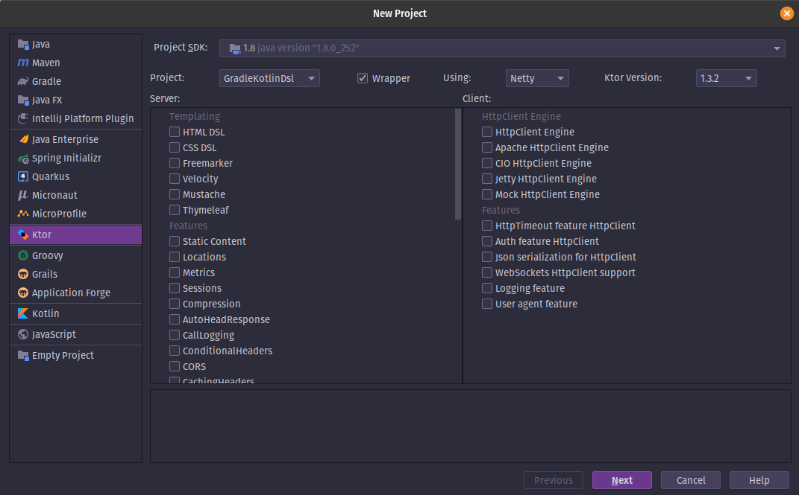
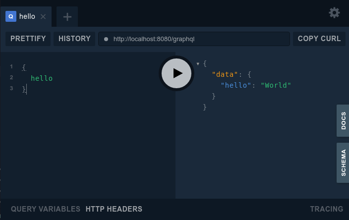

# Fully functional GraphQL & Ktor server

We will be using the [ktor intellij plugin](https://plugins.jetbrains.com/plugin/10823-ktor) to get setup.

The very first thing we'll be doing is creating a new IntelliJ project and use the ktor template.



After this we'll press "Next" and fill out the necessary information and then press "Finish". Now we have a brand new
ktor project. Now we can add the dependencies needed to our `gradle.properties` and `build.gradle.kts` files.

=== "gradle.properties"
```properties
kgraphql_version=x.x.x
```

Replace `x.x.x` with the latest
version [](https://search.maven.org/search?q=g:%22com.apurebase%22%20AND%20a:%22kgraphql%22).

=== "Kotlin Gradle Script"
```kotlin
val ktor_version: String by project
val kotlin_version: String by project
val logback_version: String by project
val kgraphql_version: String by project // <-- Add this line

    ...
    
    dependencies {
        implementation("org.jetbrains.kotlin:kotlin-stdlib-jdk8:$kotlin_version")
        implementation("io.ktor:ktor-server-netty:$ktor_version")
        implementation("ch.qos.logback:logback-classic:$logback_version")
        implementation("com.apurebase:kgraphql:$kgraphql_version")      // <-- Add these two lines
        implementation("com.apurebase:kgraphql-ktor:$kgraphql_version") // <-- Add these two lines
        testImplementation("io.ktor:ktor-server-tests:$ktor_version")
    }
    ```

=== "Gradle"
```groovy
dependencies {
    implementation "org.jetbrains.kotlin:kotlin-stdlib-jdk8:$kotlin_version"
    implementation "io.ktor:ktor-server-netty:$ktor_version"
    implementation "ch.qos.logback:logback-classic:$logback_version"
    implementation "com.apurebase:kgraphql:$kgraphql_version"      // <-- Add these two lines
    implementation "com.apurebase:kgraphql-ktor:$kgraphql_version" // <-- Add these two lines
    testImplementation "io.ktor:ktor-server-tests:$ktor_version"
}
```

The only thing left is installing the GraphQL feature onto our server by opening `src/Application.kt` and use these
lines as the `Application.module` function

=== "Application.kt"

```kotlin
fun Application.module(testing: Boolean = false) {
    install(GraphQL) {
        configureRouting()
        playground = true
        schema { 
            query("hello") {
                resolver { -> "World" }
            }
        }
    }
}
```

Now we have a fully functional GraphQL Server and we can startup our server by pressing the green play icon beside the
`main` function.

We can test out our server by going to [localhost:8080/graphql](http://localhost:8080/graphql) and our `hello` query
should work by providing this query to the GraphQL Playground



A great place to learn more is following the [Star Wars tutorial](./starwars.md). Everything mentioned in this tutorial
can be placed inside the `schema {}` block.
