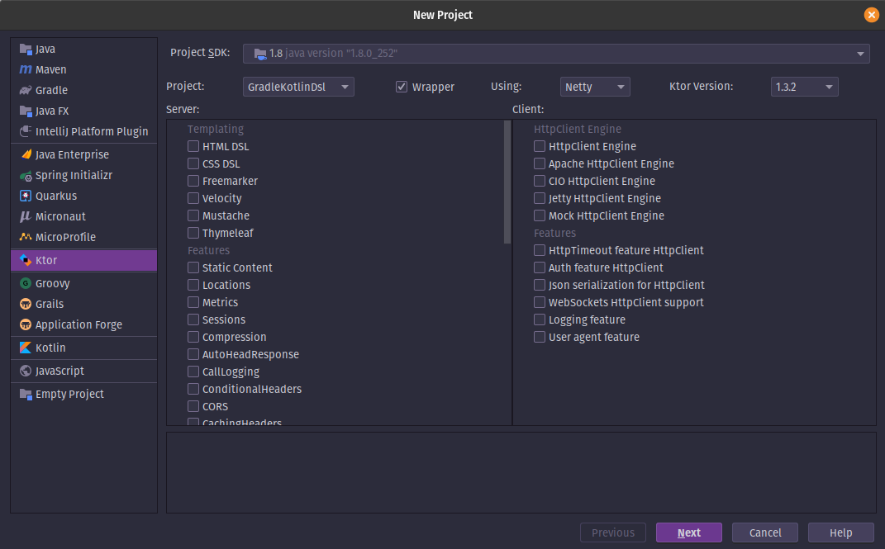
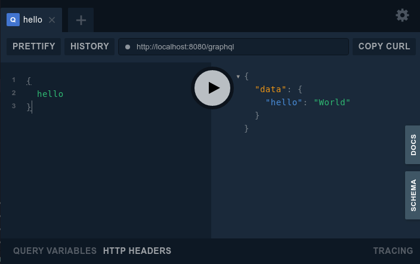

# Ktor Tutorial

We will be using the [Ktor intellij plugin](https://plugins.jetbrains.com/plugin/10823-ktor) to setup a fully functional GraphQL & Ktor server.

## Project Setup

The very first thing we'll be doing is creating a new IntelliJ project and use the Ktor template.



After this we'll press "Next" and fill out the necessary information and then press "Finish". Now we have a brand new
Ktor project.

## Dependencies

Now we can begin adding the needed dependencies.

=== "Kotlin Gradle Script"
    ```kotlin
    dependencies {
        implementation("de.stuebingerb:kgraphql:${KGraphQLVersion}")
        implementation("de.stuebingerb:kgraphql-ktor:${KGraphQLVersion}")
    }
    ```
=== "Gradle"
    ```groovy
    dependencies {
        implementation "de.stuebingerb:kgraphql:${KGraphQLVersion}"
        implementation "de.stuebingerb:kgraphql-ktor:${KGraphQLVersion}"
    }
    ```


## GraphQL Feature

The only thing left is installing the GraphQL feature onto our server by opening `src/Application.kt` and use the following
lines as the `Application.module` function.

=== "Application.kt"
    ```kotlin
    fun Application.module(testing: Boolean = false) {
        install(GraphQL) {
            configureRouting()
            playground = true
            schema {
                query("hello") {
                    resolver { -> "World" }
                }
            }
        }
    }
    ```

Now we have a fully functional GraphQL Server and we can startup our server by pressing the green play icon beside the
`main` function.

## Validating the Setup

We can test out our server by going to [localhost:8080/graphql](http://localhost:8080/graphql) and our `hello` query
should work by providing this query to the GraphQL Playground.



A great place to learn more is following the [Star Wars tutorial](./starwars.md). Everything mentioned in this tutorial
can be placed inside the `schema {}` block.
